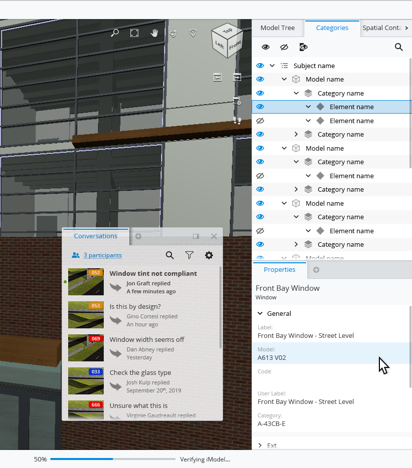

# AppUI

## Overview

AppUI is a React based framework consisting of APIs and components that enable iTwin.js applications to implement the AppUI design.
This design organizes the visual elements on the screen in a way that is familiar to users of desktop applications where the screen is divided into a content area surrounded by panels that contain widgets, toolbars, and status bar.
In an iTwin.js application, the content area is usually a [Viewport](../../learning/ui/imodel-components/Viewport.md), while information such as element properties and data hierarchies are displayed in [widgets](../../learning/ui/appui-react/Widgets).

## Layout Features

Dedicated **tool settings** area at the top of the application for components that change the operational settings of the currently executing [Tool](../../learning/frontend/Tools.md). For more information, see [Tool Settings](./create-frontstage.md#tool-settings).

Dedicated **status bar** area at the bottom of the application for components that display notifications, messages, and other feedback to the user. For more information, see [Status Bar](./create-frontstage.md#status-bar).

Interactive **widget** components that display relevant content of the application. Here a _Conversations_ widget is floating, while _Properties_, _Categories_ and other widgets are docked into the right panel. For more information, see [Widgets](./create-frontstage.md#widgets).

The main content area is overlaid by **toolbar** components. The upper left corner is dedicated to the tools that manipulate the content of the application and the upper right corner is dedicated to the tools that navigate the view. For more information, see [Toolbars](./create-frontstage.md#toolbars).
